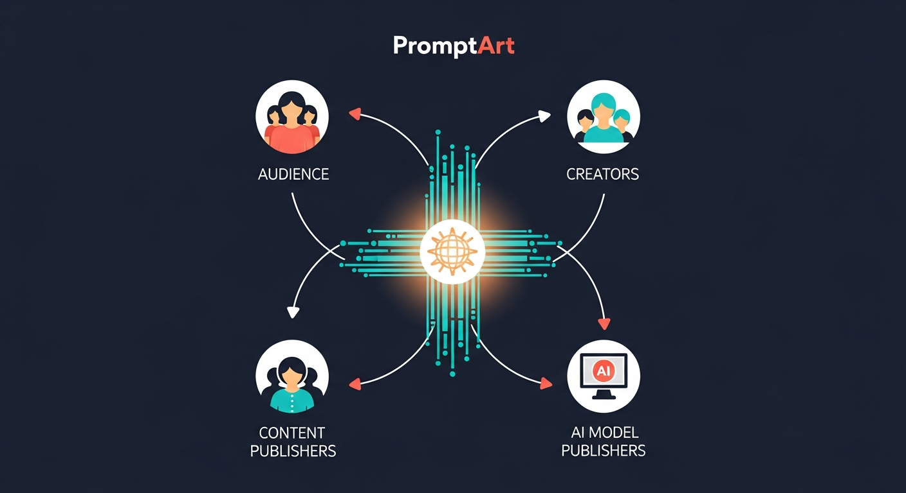
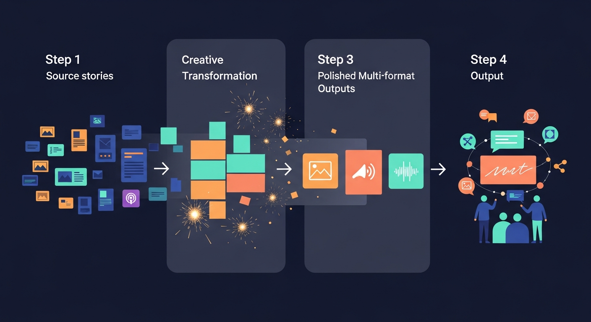
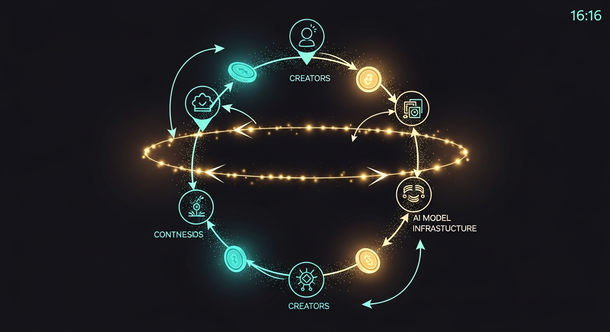

# PromptArt

<p align="center">
  
</p>

<p align="center"><strong>Content that evolves. Creativity that compounds. Value that returns to contributors.</strong></p>

<p align="center">
  
  
  
  
  
  
  
</p>

<p align="center">
  
  
  
  
  
</p>

## A New Creative Substrate
Most digital content still behaves like a finished product.
PromptArt treats content as a living medium: something that can be reinterpreted, recomposed, and redistributed in many forms while preserving who contributed and where value should flow.

## Why This Creative Model Matters
- Personalization becomes expressive, not mechanical.
- Creative participation expands beyond technical specialists.
- Distribution keeps creative memory instead of erasing lineage.
- Economic outcomes follow contribution paths, not platform opacity.

## The Ecosystem
<p align="center">
  
</p>

PromptArt brings four groups into one creative loop:
- audiences looking for relevance,
- creators building transformation styles,
- publishers contributing source material,
- model operators powering generation.

## The Journey
<p align="center">
  
</p>

From source material to transformed output, the experience is designed as a smooth progression:
- discover signals,
- shape them through composable transformations,
- publish in multiple formats,
- feed new interactions back into the system.

## The Value Loop
<p align="center">
  
</p>

When an artifact is consumed or reused, contribution trails are not discarded.
They become the basis for attribution and token movement across participants, reinforcing future creation.

## Implementation Architecture
This repository already includes a working backend prototype with event-driven generation and payment logic.

```text
API Gateway -> lambda_function_api.py -> Postgres + SQS task enqueue
                                         |
                                         v
                              lambda_function_sqs.py / docker events manager
                                         |
                                         v
                              DispatchSrv -> TransformSrv -> Atomic adapters
                                         |
                                         v
                              docs/rights/users/nodes/task state updates
```

## Code Map

### API and Routing
- `aws/projects/prompt-art-api/lambda_function_api.py`
- Maps API `operationName` to handlers for users, docs, transformers, and graph feeds.
- Handles media retrieval via `getDocMedia` and standard JSON responses for all other routes.

### Feed Graph and Generation
- `aws/core/paGraph.py`
- `FeedMng` manages feed nodes, source linkage, generation cadence, and inherited fees.
- `attach()` supports creating a companion transformer from inline config.

### Task Orchestration
- `aws/core/paTasks.py`
- `TaskMng` stores task chains in DB, enqueues work to SQS, and resolves parent/child completion.
- `BaseHandler` provides common task lifecycle hooks used by dispatch and transform services.

### Dispatch and Charging
- `aws/core/paDispatch.py`
- `DispatchSrv` drives `genAndPayFeed`, `genFeed`, `procFeed`, and `applyTransformer` flows.
- `chargeUser()` enforces fee payment before transform execution.
- `buyDocAccess()` enforces paid access to parent/source documents.

### Transformer Runtime
- `aws/core/paTransform.py`
- Transformer CRUD, chain composition (`_compose`, `_fromChain`), and fee aggregation (`_updateFees`).
- `applyAsync()` starts async execution via `TransformSrv`.

- `aws/core/paTransformSrv.py`
- Prepares transformation context, executes chain branches, merges outputs, and persists generated doc content.

### Document, Rights, and Royalties
- `aws/core/paDocs.py`
- Stores generated docs and media references.
- Creates rights entries and recursively purchases access to parent content.
- Applies prompt fee transfers when granting access to derived content.

### Wallet and Transfer Logic
- `aws/core/paUsers.py`
- Balance management, transfer operations, and multi-recipient payoff attempts.
- Supports fee maps split into `prompt_fees` and `process_fees`.

### Atomic Model Connectors
- `aws/core/paAtomic.py`
- Registry of atomic transform functions (OpenAI, Replicate, Stability, ElevenLabs, source adapters).
- `applyAtomic()` resolves transformer id -> callable adapter.

### Storage and DB Access
- `aws/core/paMedia.py` handles S3 media read/write and inline base64 conversion.
- `aws/core/paDB.py` provides direct SQL wrapper methods used across managers.

## Core Runtime Flow (Today)
1. Client calls API endpoint (`/graph/{fid}/generate`, `/transformer/{tid}/apply`, etc.).
2. API lambda validates/request-parses and dispatches to manager logic.
3. Generation tasks are persisted in `tasks` and queued to SQS.
4. Worker consumes task and routes by method (`genFeed`, `procFeed`, `applyTransformer`, etc.).
5. Dispatch service checks access + user token budget, then creates transform tasks.
6. Transform service executes atomic or chained transformers and stores output in `docs`.
7. Rights and fee transfers are applied as docs are generated and accessed.

## Data Objects in Use
- `users`: profiles, balances, subscriptions.
- `transformer`: transformer config and fee maps.
- `nodes`: feed graph nodes and generation metadata.
- `docs`: generated documents and media-linked content.
- `rights`: doc-level access permissions.
- `tasks`: async task-chain state.

## What Is Implemented vs Next Horizon

Implemented now:
- API + async generation pipeline.
- Feed graph generation and chaining.
- Token charging and fee distribution primitives.
- Access rights gating across derived documents.

Next horizon:
1. first-class provenance edges for artifact lineage,
2. immutable ledger entries for auditable settlement,
3. cycle-based cashback/accounting automation,
4. stronger production hardening (secrets, query safety, idempotency).

## Project Materials
- Product deck: `docs/PromptArt_latest.pptx`
- Deck interpretation: `docs/PPT_ANALYSIS.md`
- Deep code analysis: `DEEP_CODE_ANALYSIS.md`
- API draft: `aws/configs/api.yaml`
- Visual prompt archive: `docs/infographics/infographic_prompts.txt`

---

PromptArt explores a future where content systems learn from creative behavior and return meaningful upside to the participants who shape them.
