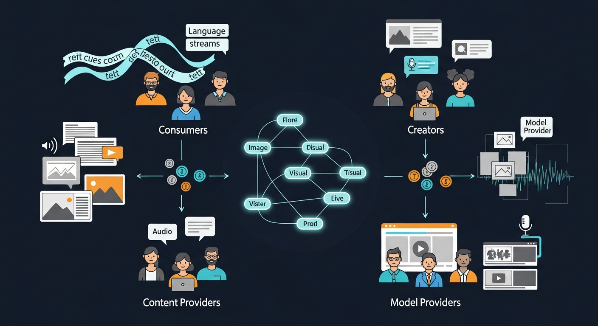
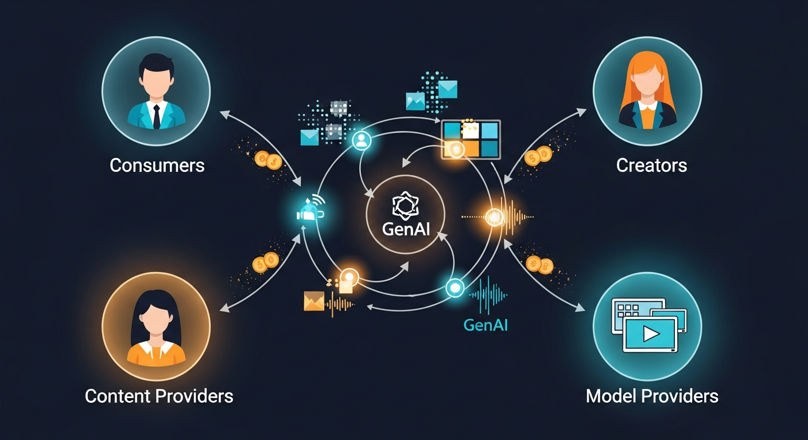
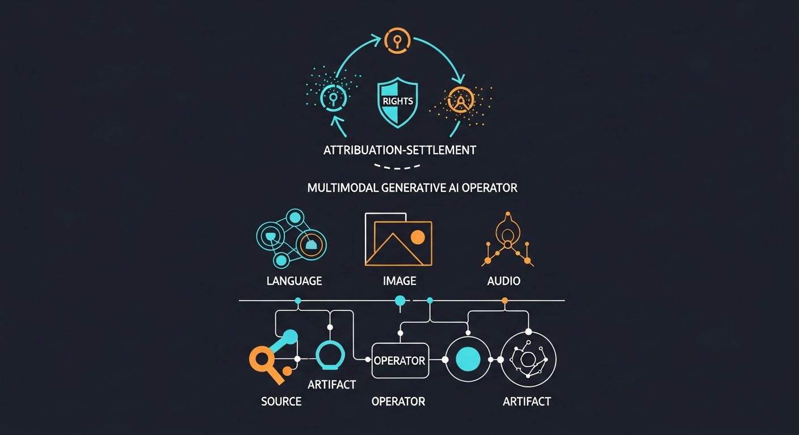
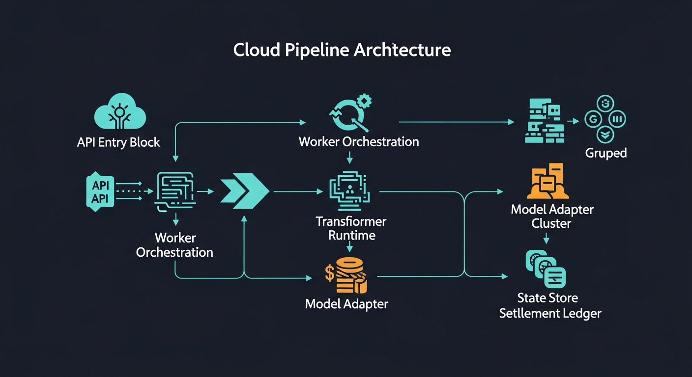

# PromptArt

<p align="center">
  
</p>

<p align="center"><strong>A graph-native system for crowdsourced GenAI content transformation, attribution, and value circulation.</strong></p>

## Motivation
Digital content ecosystems are structurally fragmented:
- generation is powerful but often isolated,
- lineage is weak across derivative outputs,
- value distribution rarely reflects true contribution paths.

PromptArt addresses this gap by treating generation, provenance, and settlement as one integrated graph process rather than separate products.

## Vision
PromptArt advances a **Crowdsourced Content Transformation Graph (CCTG)** in which:
- source content, transformation operators, and generated artifacts coexist in one evolving network,
- every transformation becomes a reusable graph edge,
- attribution and economic flow are computed over the same graph paths that produce content.

The long-term outcome is a creative infrastructure where personalization scales without disconnecting provenance and contributor upside.

<p align="center">
  
</p>

## Core Technology

### 1. Graph-Native Transformation Substrate
The platform models content evolution as a directed graph:
- roots: ingested sources,
- operators: atomic and composed transformers,
- outputs: multimodal artifacts,
- return paths: attribution and settlement edges.

### 2. Multimodal GenAI Operator Layer
Transformation edges are powered by language, image, and audio adapters, enabling:
- text rewriting/synthesis,
- text-to-image generation,
- speech-to-text and text-to-speech conversion,
- mixed-modality transformation chains.

### 3. Attribution and Settlement Logic
Consumption and reuse events are tied to graph lineage, enabling:
- contribution-aware allocation,
- rights-gated access across derived artifacts,
- settlement updates aligned to transformation ancestry.

<p align="center">
  
</p>

## Impact Across User Groups

### Consumers
- Receive richer, personalized outputs from the same source corpus.
- Benefit from continuously improving transformation pathways.

### Creative Artists
- Publish transformation operators as reusable graph components.
- Capture downstream value when their operators are reused.

### Content Providers
- Contribute source nodes that remain traceable across derivations.
- Participate in value flow as content propagates through the graph.

### Model Providers
- Supply core inference capabilities in language/image/audio layers.
- Gain participation in transformation-driven economic activity.

## Implementation and Architecture

The current repository implements an AWS-based asynchronous pipeline:

```text
API Gateway -> API Lambda -> Task Queue (SQS) -> Worker Dispatch -> Transformer Runtime
                                  |                                      |
                                  v                                      v
                          Graph/Doc/Right State                  Multimodal Model Adapters
                                  |                                      |
                                  +---------- Attribution + Settlement ---+
```

<p align="center">
  
</p>

### Implemented Architecture Components
- API orchestration: `aws/projects/prompt-art-api/lambda_function_api.py`
- Queue workers: `aws/projects/prompt-art-sqs/lambda_function_sqs.py` and Docker events manager
- Task engine: `aws/core/paTasks.py`
- Dispatch + charging flow: `aws/core/paDispatch.py`
- Transformer composition/runtime: `aws/core/paTransform.py`, `aws/core/paTransformSrv.py`
- Graph/feed management: `aws/core/paGraph.py`
- Document rights and access control: `aws/core/paDocs.py`
- Wallet/transfer primitives: `aws/core/paUsers.py`
- Media persistence layer: `aws/core/paMedia.py`
- Adapter registry (language/image/audio/source): `aws/core/paAtomic.py`

### Current Technical State
- End-to-end async generation exists.
- Graph-linked feed and transformer orchestration exists.
- Rights checks and token charging exist.
- Foundation for attribution-aware settlement exists and is extensible toward richer ledger-grade accounting.

---

PromptArt positions generative media as a graph systems problem: composition, provenance, and value distribution become first-class properties of the same computational structure.
